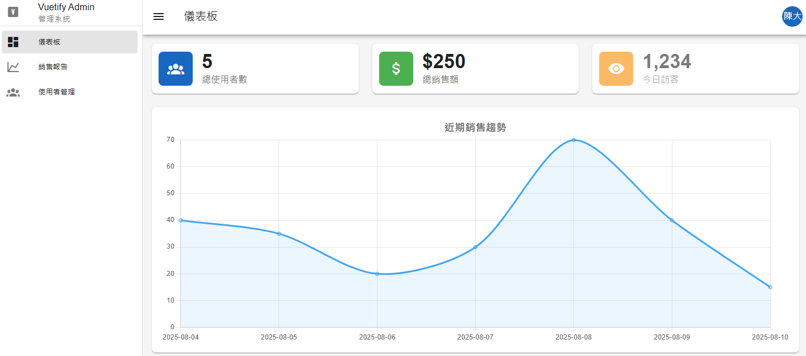

# Vue 3 + Vuetify 3 後台管理系統

這是一個使用 Vue 3、Vuetify 3、Pinia 和 Vue Router 打造的現代化、功能齊全的後台管理系統範本。專案旨在展示前端開發的最佳實踐，包括元件化架構、狀態管理、API 串接和數據視覺化。

---

## ✨ 線上預覽 (Live Demo)

您可以透過以下連結，直接在線上操作這個專案：

**[點擊這裡前往線上預覽](https://raellen.github.io/vue-backend/)**

* **登入資訊**：請使用 `david@example.com` 或 `mary@example.com` 等存在於模擬後端中的 Email 進行登入（密碼可任意輸入）。

---

## 🚀 主要功能 (Features)

* **使用者認證**：完整的登入、登出流程，並透過路由守衛保護後台頁面。
* **響應式佈局 (RWD)**：使用 Vuetify 3 的網格系統，在桌面、平板和手機上都有良好的視覺表現。
* **儀表板 (Dashboard)**：
    * 以資訊卡片呈現關鍵數據。
    * 使用 `Chart.js` 繪製動態銷售數據曲線圖，數據來源於模擬後端。
    * 可點擊的資訊卡片，快速導航至相關頁面。
* **使用者管理 (CRUD)**：
    * 使用 `v-data-table-server` 實現伺服器端分頁、排序。
    * 整合新增、讀取、更新、刪除使用者的完整操作。
* **銷售報告**：以表格形式展示詳細的銷售紀錄。
* **狀態管理**：使用 Pinia 集中管理全域狀態，如使用者資訊、載入狀態和通知訊息。

---

## 🛠️ 技術棧 (Technology Stack)

* **核心框架**: [Vue 3](https://vuejs.org/) (使用 Composition API & `<script setup>`)
* **UI 框架**: [Vuetify 3](https://vuetifyjs.com/)
* **專案建構**: [Vite](https://vitejs.dev/)
* **狀態管理**: [Pinia](https://pinia.vuejs.org/)
* **路由**: [Vue Router](https://router.vuejs.org/)
* **HTTP 客戶端**: [Axios](https://axios-http.com/)
* **數據圖表**: [Chart.js](https://www.chartjs.org/) & [vue-chartjs](https://vue-chartjs.org/)
* **程式碼風格**: ESLint & Prettier